<!-- markdownlint-disable MD033 -->

# AFragmenter

AFragmenter is a schema-free, tunable protein domain segmentation tool for AlphaFold structures based on network analysis.

### Key features

- **Schema free**: AFragmenter only uses the PAE values from AlphaFold structures. No domain-segmentation scheme is learned or used for evaluation.

- **Tunable segmentation**: The 'resolution' parameter gives control over the coarseness of clustering, and thus the number of clusers / domains.
  - **Higher resolution**: Yields more, smaller clusters
  - **Lower resolution**: Yields fewer, larger clusters

### How it works

1. **Network representation**: Each protein residue is treated as a node within a fully connected network
2. **Edge weighting**: The edges between the nodes are weighted using transformed **Predicted Aligned Error** (PAE) values from AlphaFold, reflecting relative positional confidence between residues.
    <details>
    <summary>Details on the use of PAE values</summary>

    - PAE values show differences when looking between inter- versus intra-domain residue pairs.
    - Intra-domain residue paris are expected to have lower PAE values compared to inter-domain residue pair.
    - This difference is used to distinguish well-structured regions within a protein structure from other well-structured regions and from poorly structured regions.
    - This enables us to cluster protein residue pairs of well-structured regions together.

    </details>

3. **Clustering with Leiden algorithm**: Utilizes the Leiden clustering algorithm to group residues into domains, with adjustable resolution parameters to control cluster granularity.

<br>

| Resolution = 0.8 | Resolution = 1.1 | Resolution = 0.3 |
|:----------------:|:----------------:|:----------------:|
|  |  | 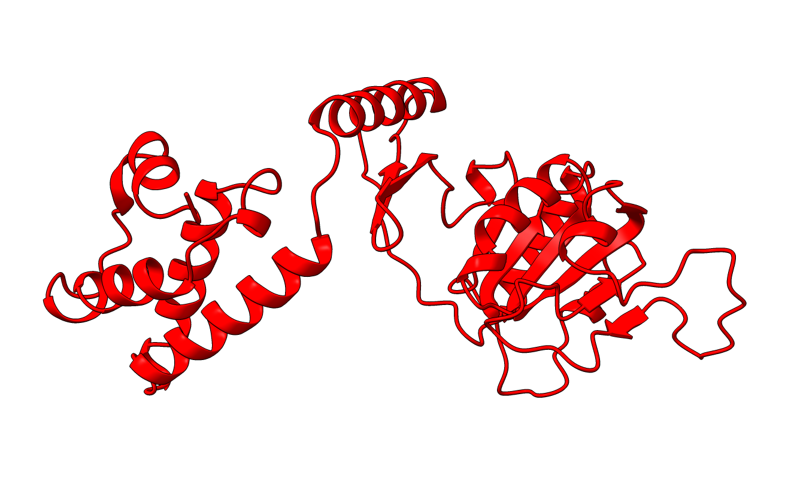 |

<p style="text-align: right">protein: P15807&nbsp;&nbsp;&nbsp;&nbsp;&nbsp;</p>

## Table of contents

1. [Try it](#try-it)
2. [Installation](#installation)
3. [Tutorial](#quick-tutorial)
4. [Usage](#usage)
   1. [Python](#python)
   2. [Command line](#command-line)
5. [Options](#options)
    1. [Threshold](#threshold)
    2. [Resolution](#resolution)

## Try it

The recommended way to use AFragmenter is through jupyter notebooks, where visualization and fine-tuning of parameters is most easily done.
The easiest way to begin is by using our [Google colab notebook](https://colab.research.google.com/drive/1QQ3MO0kaTrJxD9EH1jghProsAe3Kmoru?usp=sharing).

- **Note**: While colab notebooks offers convenience, it can experience slower performance due to shared resources.

An alternative way to get started is by using the [webtool] (coming soon)

## Installation

### System Requirements

- **Python Version**: Ensure you have Python 3.9 or higher installed on your system.
- **Operating Systems**: The tool is compatible with Linux, macOS, and Windows.

### Installation Steps

1. **Set Up a Virtual Environment (Recommended)**:
   Creating a virtual environment helps manage dependencies effectively. Here's how to set it up:

   ```bash
   # Install virtualenv if not already installed
   pip install virtualenv
   
   # Create a new virtual environment
   virtualenv myenv
   
   # Activate the virtual environment
   # On Windows:
   myenv\Scripts\activate
   # On macOS/Linux:
   source myenv/bin/activate
   ```

   or alternatively, create and use a conda environment `conda create --name myenv pip 'python>=3.9'` & `conda activate myenv`

2. **Install AFragmenter**:
   Install the package using pip within your activated virtual environment.

   ```bash
   pip install AFragmenter
   ```

3. **Optional Dependencies**:
   - **py3Dmol**: Required for protein structure visualization.

     ```bash
     pip install py3Dmol
     ```

### Verification

After installation, verify that AFragmenter is correctly installed by running:

```bash
afragmenter --version
```

This command should display the installed version of AFragmenter.

## Quick Tutorial

In this short tutorial, we will walk through the process of using AFragmenter to segment protein domains based on AlphaFold structures. We will use the example protein P15807 (PDB: 1KYQ) to demonstrate the steps involved. This protein is classified differently by various protein domain databases, making it an interesting case for domain segmentation.

> P15807 is classified as a three-domain protein in both [CATH](https://www.cathdb.info/pdb/1kyq) and [ECOD](http://prodata.swmed.edu/ecod/af2_pdb/domain/e1kyqA1#tab-organization), a two-domain protein in [SCOPe](https://scop.berkeley.edu/pdb/code=1kyq) and [InterPro](https://www.ebi.ac.uk/interpro/protein/UniProt/P15807/), and a single-domain protein in [SCOP](https://www.ebi.ac.uk/pdbe/scop/term/8001033).

<br>

Since AFragmenter is dependent on the PAE values of AlphaFold, it is a good idea to first have a look at the PAE plot.

```python
from afragmenter import AFragmenter, fetch_afdb_data

pae, structure = fetch_afdb_data('P15807')
p15807 = AFragmenter(pae) # Or bring your own files: a = AFragmenter('filename.json')
p15807.plot_pae()
```

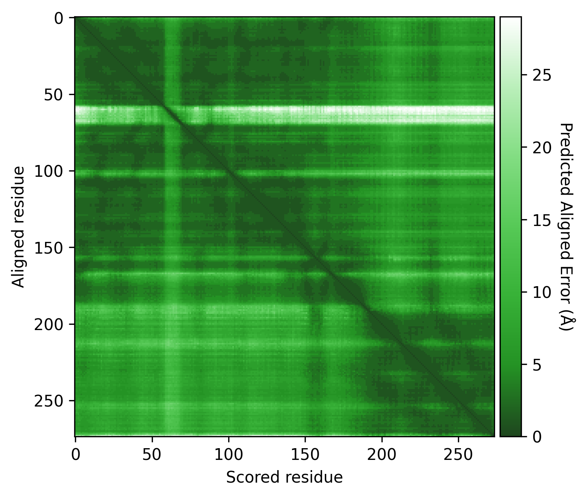

Here we see some regions of very low PAE values (dark green) on the PAE matrix, which could indicate different domains. However, there are still many green (low PAE) datapoints visible around these potential domains. Therefore, it is important to consider the **PAE contrast threshold** used.

These PAE values are transformed into edge weights to increase the contrast between high and low PAE values. The **PAE contrast threshold** can be adjusted to control this contrast. Below, we can see the effect of different thresholds on the weights of the graph.

<details>
<summary>Show code</summary>

```python
from afragmenter.plotting import plot_matrix

p15807 = AFragmenter(pae)
fig, ax = plt.subplots(2, 2, figsize=(10, 10))

p15807.plot_pae(ax=ax[0, 0])
plot_matrix(p15807.edge_weights_matrix, ax=ax[0, 1])

p15807 = AFragmenter(pae, threshold=3)
plot_matrix(p15807.edge_weights_matrix, ax=ax[1, 0])

p15807 = AFragmenter(pae, threshold=1)
plot_matrix(p15807.edge_weights_matrix, ax=ax[1, 1])

ax[0, 0].set_title('PAE matrix')
ax[0, 1].set_title('Edge weights matrix (threshold=5)\n[default]')
ax[1, 0].set_title('Edge weights matrix (threshold=3)')
ax[1, 1].set_title('Edge weights matrix (threshold=1)')

plt.tight_layout()
plt.show()
```

</details>


A threshold of 3 seems to give a good contrast between the higher and lower PAE values.

Next, we cluster the residues into domains using the Leiden clustering algorithm. We get a result, but the resolution parameter can be changed to explore multiple potential solutions.

```python
p15807 = AFragmenter(pae, threshold=3)
p15807.cluster() # default resolution = 0.8
p15807.plot_result()
p15807.py3Dmol(structure)
```

<p style="display: flex" float="left">
    
    
</p>

```python
p15807.cluster(resolution=1.1)
```

<p style="display: flex" float="left">
    
    
</p>

```python
p15807.cluster(resolution=0.3)
```

<p style="display: flex" float="left">
    
    
</p>

Once a solution has been found that is satisfactory to the user, we can print the result and the FASTA file for each domain, or save them to files for further analysis.

```python
p15807 = AFragmenter(pae, threshold=3)
p15807.cluster(resolution=1.1)
p15807.print_result()

    ┏━━━━━━━━┳━━━━━━━━━━━━━━━━━━━━┳━━━━━━━━━━┓
    ┃ Domain ┃ Number of Residues ┃ Chopping ┃
    ┡━━━━━━━━╇━━━━━━━━━━━━━━━━━━━━╇━━━━━━━━━━┩
    │ 1      │                137 │   10-146 │
    │ 2      │                 47 │  147-193 │
    │ 3      │                 81 │  194-274 │
    └────────┴────────────────────┴──────────┘

p15807.print_fasta(structure)

    >P15807_1 10-146
    QLKDKKILLIGGGEVGLTRLYKLIPTGCKLTLVSPDLHKSIIPKFGKFIQNEDQPDYRED
    AKRFINPNWDPTKNEIYEYIRSDFKDEYLDLEDENDAWYIIMTCIPDHPESARIYHLCKE
    RFGKQQLVNVADKPDLC
    >P15807_2 147-193
    DFYFGANLEIGDRLQILISTNGLSPRFGALVRDEIRNLFTQMGDLAL
    >P15807_3 194-274
    EDAVVKLGELRRGIRLLAPDDKDVKYRMDWARRCTDLFGIQHCHNIDVKRLLDLFKVMFQ
    EQNCSLQFPPRERLLSEYCSS


# Or save it
p15807.save_result('result.csv')
p15807.save_fasta(structure, 'result.fasta')
```

## Usage

- [Python](#python)
- [Command line](#command-line)

### Python

Docs coming soon...

### Command line


## Options

- [Threshold](#threshold)
- [Resolution](#resolution)
- [Objective function](#objective-function)
- [Minimum size](#minimum-size)
- [Merge](#merge)
- [Print / Save result](#print--save-result)

### Threshold

The 'contrast threshold' serves as a soft cut-off to increase the distinction between low and high PAE values. Used in calculating the edge weights of the network and will thus have a large impact on the clustering and segmentation results. It is important to consider this threshold in the context of the AlphaFold results for the protein of interest.

**Examples**:

#### [Q5VSL9](https://alphafold.ebi.ac.uk/entry/Q5VSL9)

Overall good structure with high pLDDt and low PAE scores for the majority of the protein, and lower pLDDT and high PAE scores for the disordered regions / loops, like is expected. Default threshold should be good.

| AlphaFold structure | PAE plot | Edge weights |
|:-------------------:|:----------:|:------------:|
| 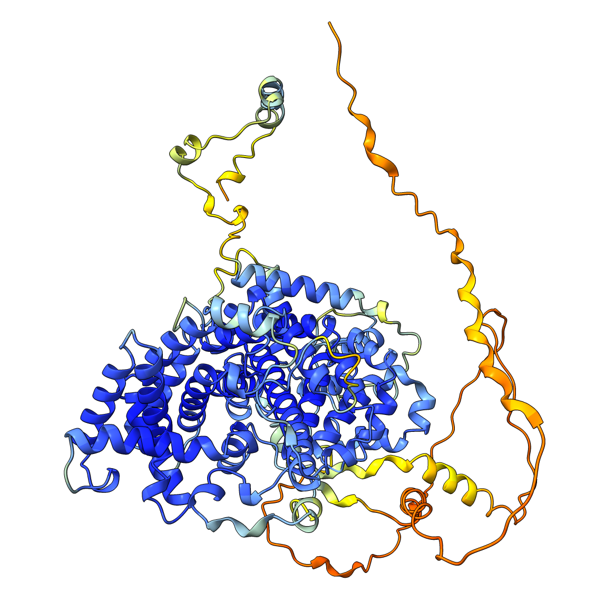 | 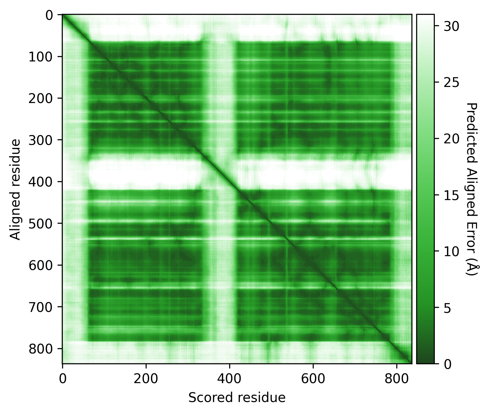 | 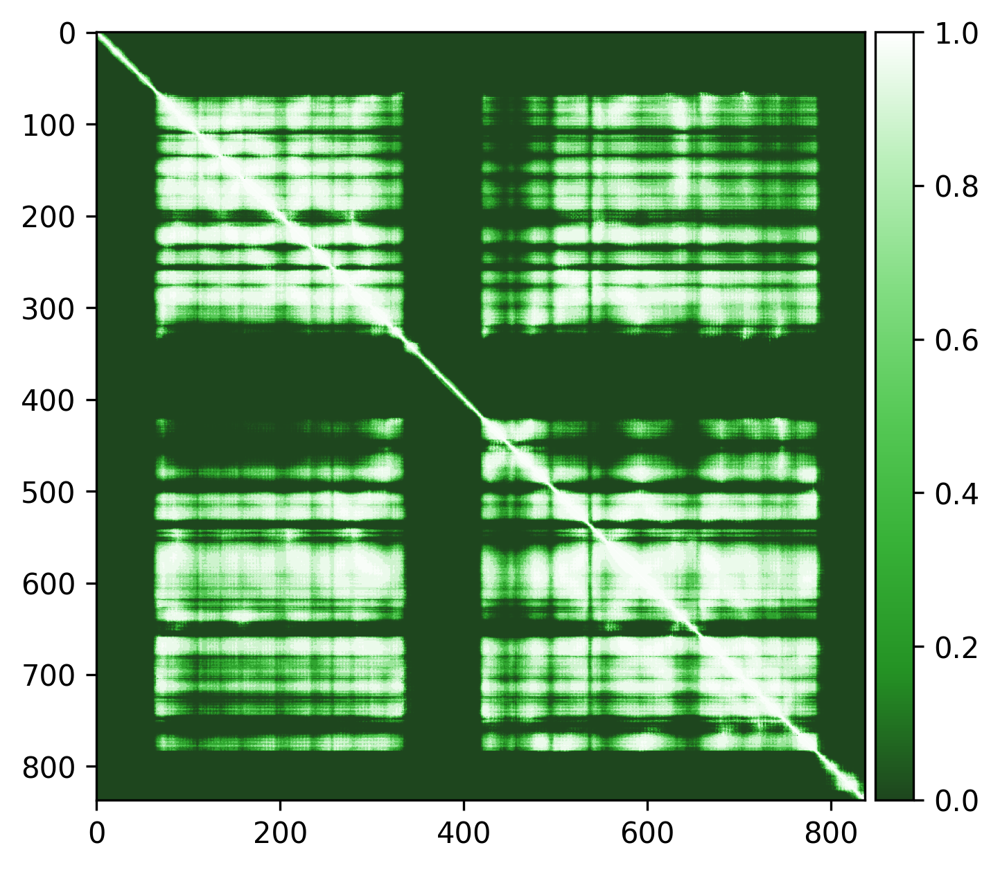 |

#### [P15807](https://alphafold.ebi.ac.uk/entry/P15807)

Very high pLDDT scores and low PAE scores for the AlphaFold structure indicating strong confidence, with one loop as exception. Several linkers, including the disordered N-terminal region, also show unexpectedly high pLDDT scores and low PAE scores, contrary to what would be expected for such regions. This apparent overconfidence is likely due to the inclusion of the crystal structure (1KYQ) in the AlphaFold training dataset.

Lowering the treshold can help reduce this apparent confidence, making it easier to differentiate between genuinely well-structured regions ans those that are more likely to be flexible or disordered.

| AlphaFold structure | PAE plot |
|:-------------------:|:--------:|
| 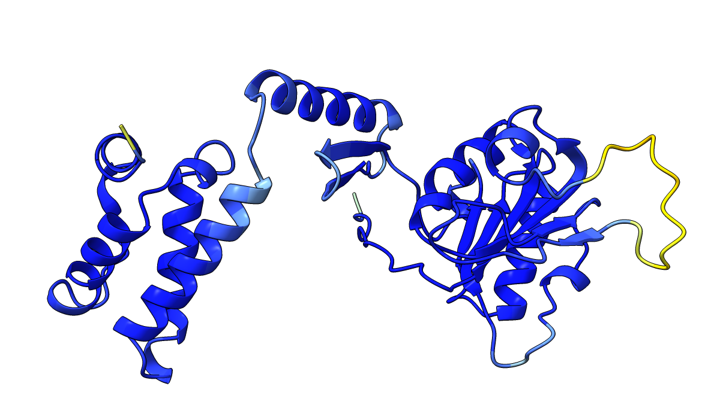 |  |
| <strong>Edge weights (default threshold = 5)</strong> | <strong>Edge weights (treshold = 3)</strong> |
| 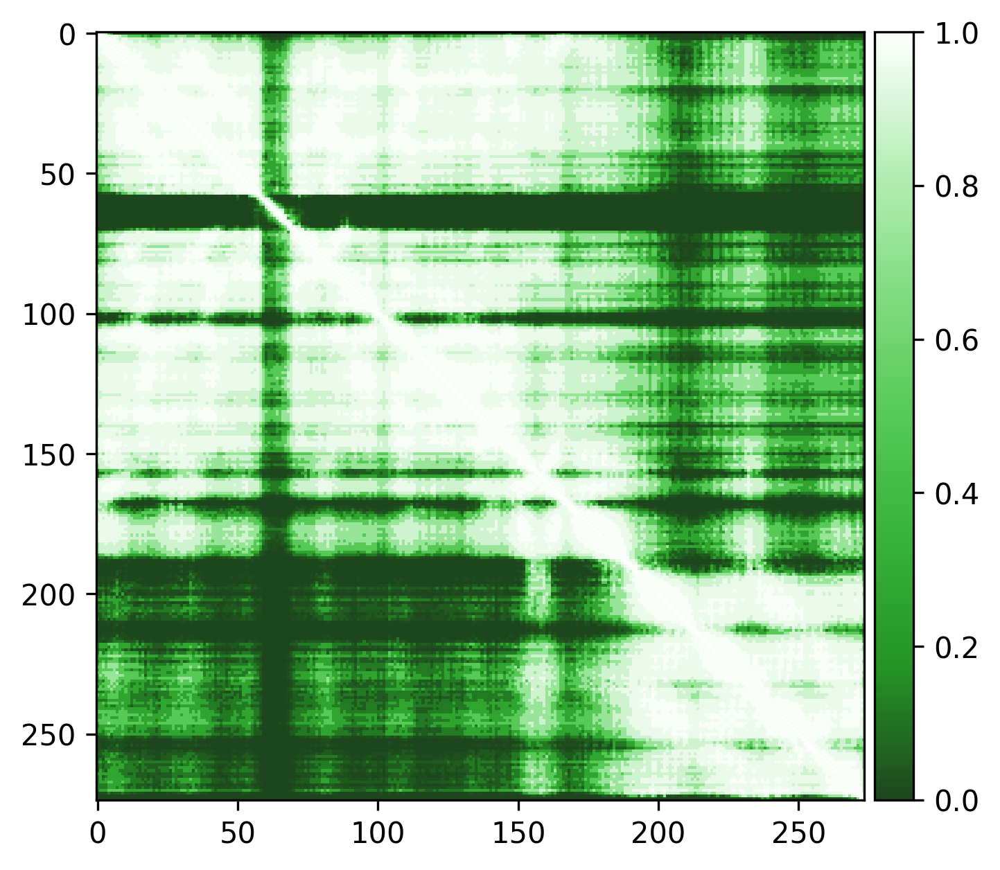 | 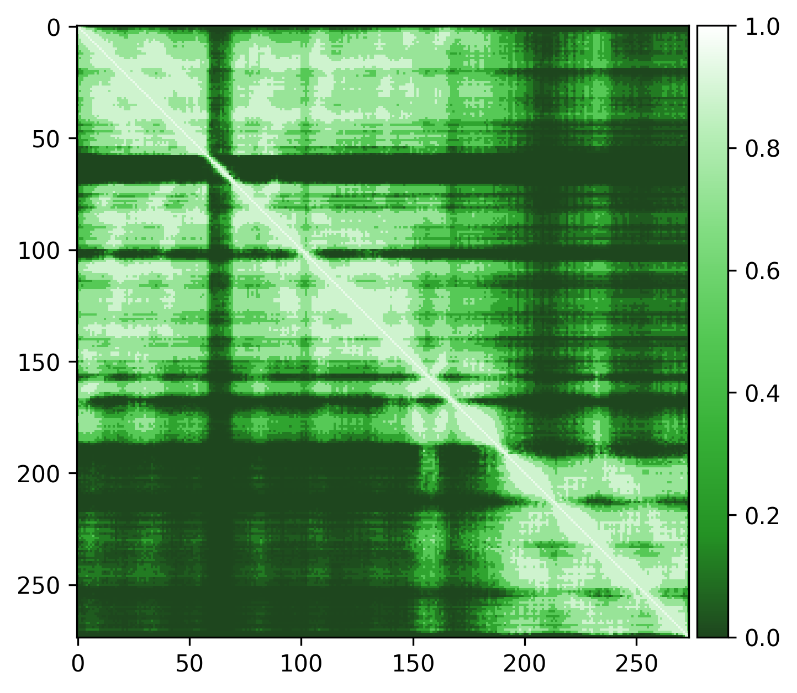 |


#### [Q9YFU8](https://alphafold.ebi.ac.uk/entry/Q9YFU8)

Q9YFU8 is a great example to remind us again that the PAE scores are not originally intended to be used for domain segmentation, but instead are a measure of how confident AlphaFold is in the relative position of two residues.

...

# To be continued soon

| AlphaFold structure | PAE plot | Crystal structures: 1W5S (green) and 1W5T (red) |
|:-------------------:|:--------:|:-----------------------------------------------:|
| 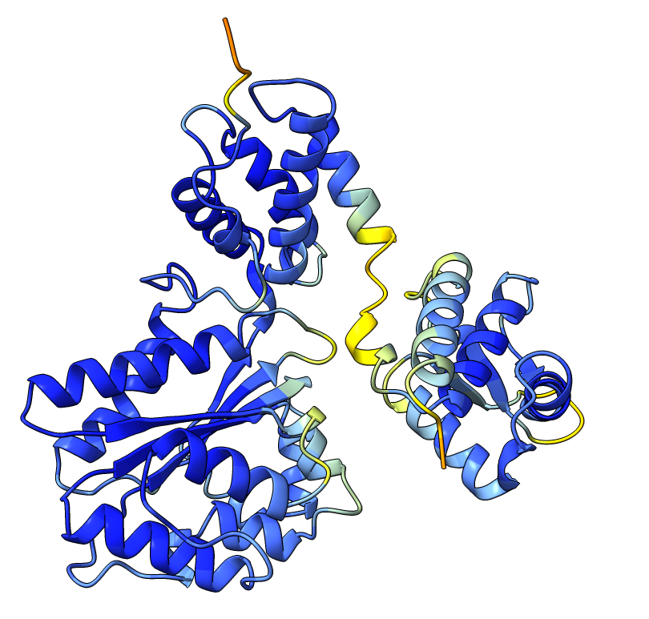 | 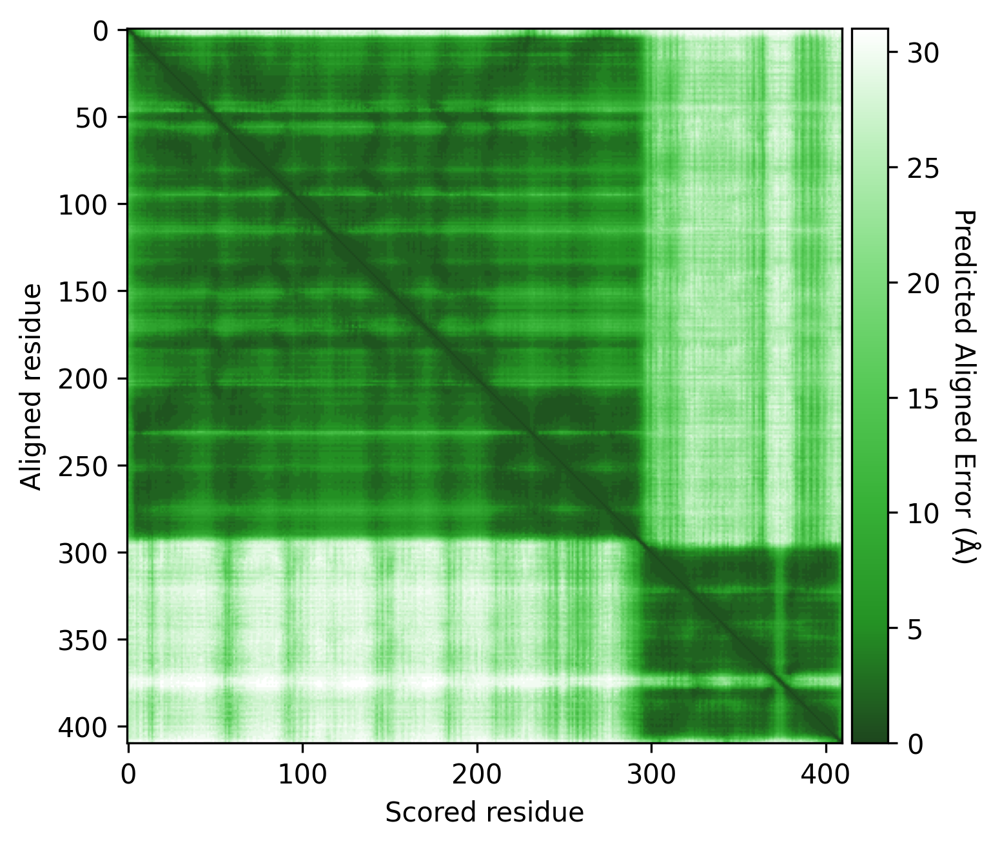 | 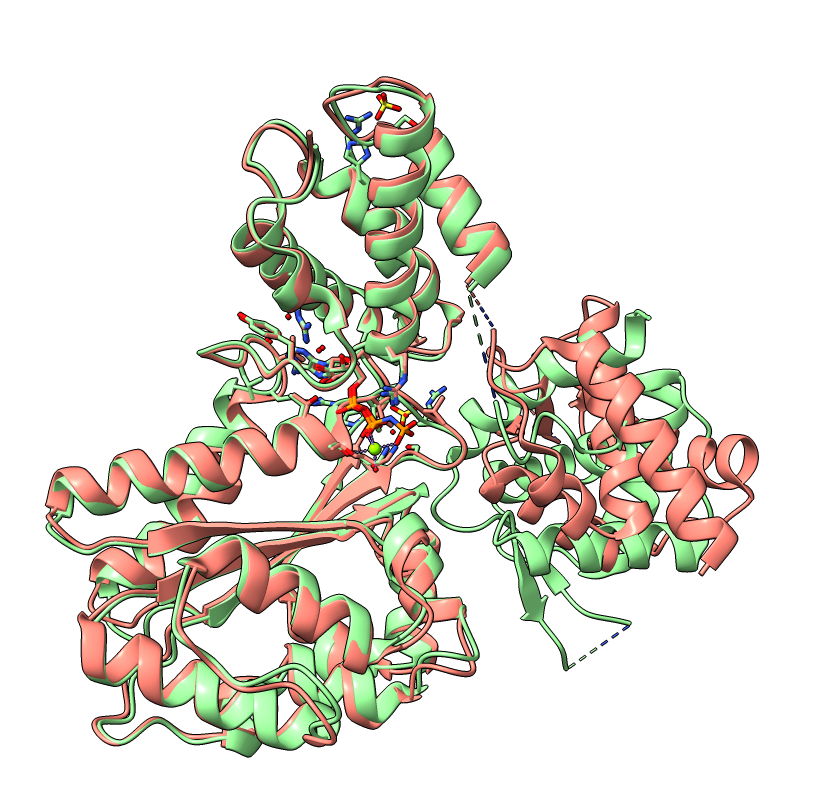 |


---------------


The 'contrast threshold' serves as a soft cut-off to increase the contrast between low and high PAE values. This increased contrast leads to more distinct, better-defined clusters. Used in calculation for the edge weights in the network using the following formula: $edge weight=\frac{1}{1 + e^{(PAE - threshold)}}$.

Below you can see the impact of the threshold on the edge weights matrix used for the network. Adjusting the threshold can help in distinguishing between different domains by increasing the contrast between low and high PAE values, leading to more distinct and better-defined clusters.


<details>
<summary>Show code</summary>

```python
from afragmenter.plotting import plot_matrix

fig, ax = plt.subplots(4, 3, figsize=(15, 20))

q5vsl9_pae, _ = fetch_afdb_data('Q5VSL9')
q5vsl9 = AFragmenter(q5vsl9_pae)
q5vsl9.plot_pae(ax=ax[0, 0])
plot_matrix(q5vsl9.edge_weights_matrix, ax[0, 1])
q5vsl9 = AFragmenter(q5vsl9_pae, threshold=10)
plot_matrix(q5vsl9.edge_weights_matrix, ax[0, 2])

ax[0, 0].set_title('Q5VSL9 PAE matrix')
ax[0, 1].set_title('Q5VSL9 edge weights matrix\n(default threshold = 5)')
ax[0, 2].set_title('Q5VSL9 edge weights matrix\nthreshold = 10')


p15807_pae, _ = fetch_afdb_data('P15807')
p15807 = AFragmenter(p15807_pae)
p15807.plot_pae(ax=ax[1, 0])
plot_matrix(p15807.edge_weights_matrix, ax[1, 1])
p15807 = AFragmenter(p15807_pae, threshold=3)
plot_matrix(p15807.edge_weights_matrix, ax[1, 2])

ax[1, 0].set_title('P15807 PAE matrix')
ax[1, 1].set_title('P15807 edge weights matrix\n(default threshold = 5)')
ax[1, 2].set_title('P15807 edge weights matrix\nthreshold = 3')


p50600_pae, _ = fetch_afdb_data('P50600')
p50600 = AFragmenter(p50600_pae)
p50600.plot_pae(ax=ax[2, 0])
plot_matrix(p50600.edge_weights_matrix, ax[2, 1])
p50600 = AFragmenter(p50600_pae, threshold=10)
plot_matrix(p50600.edge_weights_matrix, ax[2, 2])

ax[2, 0].set_title('P50600 PAE matrix')
ax[2, 1].set_title('P50600 edge weights matrix\n(default threshold = 5)')
ax[2, 2].set_title('P50600 edge weights matrix\nthreshold = 10')


a0a098aqt8_pae, _ = fetch_afdb_data('A0A098AQT8')
a0a098aqt8 = AFragmenter(a0a098aqt8_pae)
a0a098aqt8.plot_pae(ax=ax[3, 0])
plot_matrix(a0a098aqt8.edge_weights_matrix, ax[3, 1])
a0a098aqt8 = AFragmenter(a0a098aqt8_pae, threshold=20)
plot_matrix(a0a098aqt8.edge_weights_matrix, ax[3, 2])

ax[3, 0].set_title('A0A098AQT8 PAE matrix')
ax[3, 1].set_title('A0A098AQT8 edge weights matrix\n(default threshold = 5)')
ax[3, 2].set_title('A0A098AQT8 edge weights matrix\nthreshold = 20')

plt.tight_layout()
plt.show()
```

</details>


### Resolution

The **resolution** can be thought of as the coarseness of clustering. Increasing the resolution will result in more, smaller clusters (/domains). Decreasing the resolution will result in fewer but larger clusters.


### Objective function

### Minimum size

### Merge

### Print / Save result
