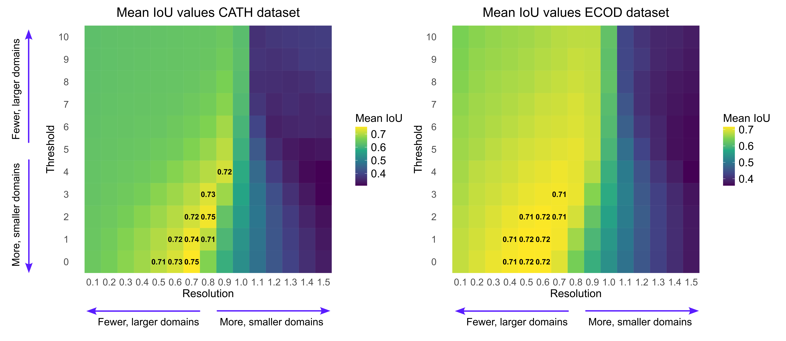

# Benchmarking Overview

## Data overview

Benchmarking was performed using protein domain definitions from two established structural classification databases: **CATH v4.4** and **ECOD v292**. To reduce redundancy, both datasets were derived from data clustered at **40% sequence similarity**.

### CATH Dataset

* **1,000 unique protein entries** randomly sampled from CATH.
* Mapped PDB IDs to UniProt IDs, and verified availability of full-length **AlphaFold structures** in the **AFDB**.
* Applied **stringent length filtering**: only entries with ≤10% difference in residue length between PDB and AlphaFold models were retained.
* Ensured ground-truth domains did not exceed AlphaFold model lengths by more than 10%.
* Retained only **unique PDB-UniProt pairs**.
* Evaluated **AFragmenter** predictions across **165 parameter combinations**:

  * **Threshold**: 0–10 (step 1)
  * **Resolution**: 0.1–1.5 (step 0.1)
  * All other parameters used default values.

### ECOD Dataset

* **500 entries** from ECOD, sampled using the same method as CATH.
* Additional **500 AlphaFold structures** randomly sampled from **AFDB v4**, selected solely by availability.
* Benchmarked AFragmenter against ECOD domain definitions using the same parameter grid as above.

## Evalution metric

The accuracy of AFragmenter’s domain segmentation was evaluated using the **Intersection over Union (IoU)** metric, specifically **IoUchain**, inspired by methods from *Merizo* and *Chainsaw*.

For each protein chain:

* **Ground-truth domains** (*Ti*) were paired with at most one **predicted domain** (*Pi*), maximizing total IoU across pairs.
* Each *Pi* was assigned only once.
* Residues labeled as or predicted to be **non-domain** were excluded from the IoU computation.

The **IoUchain** metric averages domain-level IoUs weighted by domain length:

IoU_chain = Σᵢ (|Tᵢ ∩ Pᵢ| / |Tᵢ ∪ Pᵢ|) × (|Tᵢ| / Σⱼ |Tⱼ|)

Where:

* *ndom* = number of ground-truth domains
* *Ti*, *Pi* = residue sets for ground-truth and predicted domains
* *|Ti ∩ Pi|* = overlap in residues
* *|Ti ∪ Pi|* = union of residues
* Final score reflects **weighted average overlap** across all domain pairs.

## Results

<!--Figure benchmarking/images/benchmarking_heatmap_with_arrows.png-->

### General Trends

* **Resolution > 1.0–1.1**: Leads to **over-segmentation** and lower IoU.
* **Threshold > 7–8**: Causes **under-segmentation** and degraded performance.
* **Optimal performance** is consistently observed within specific regions of the parameter space.

### Recommended Parameter Search Space

To achieve high agreement with established domain definitions:

* **Threshold**: `0–4`
* **Resolution**: `0.4–0.8`

Suggested starting points:

* `Threshold=1, Resolution=0.7` for **CATH-like** results
* `Threshold=0, Resolution=0.6` for **ECOD-like** results

> ⚠️ This is a recommended **starting search space**. Depending on the desired granularity or use case, exploring values outside these ranges may be informative.
> Higher values generally produce more, smaller domains; lower values yield fewer, broader domains.
